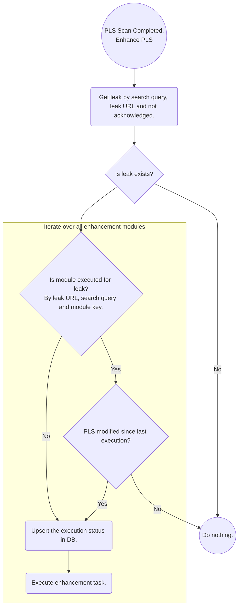

# Documentation for enhance_potential_leak_source_use_case.py

## Cases
- PLS scanned for the first time.
- PLS found again on an n+ scan.
  - PLS acknowledged.
  - PLS not acknowledged.
    - PLS wasn't modified since previous run.
    - PLS modified since previous run.
    - New enhancement modules have been added since the previous scan.
- PLS found again, but for a different search query.

## Highlights
- In the case of same PLS found from a different search query - 
  run again all modules for the found PLS, due to the expected low number of such cases.

## Diagram

